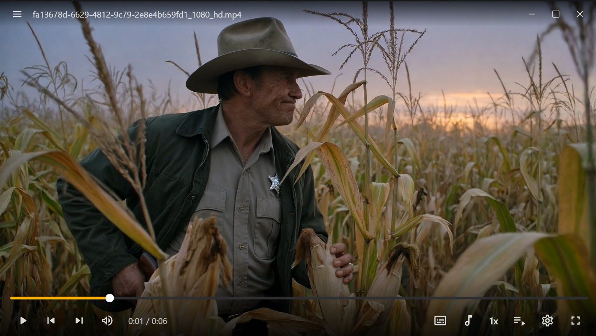
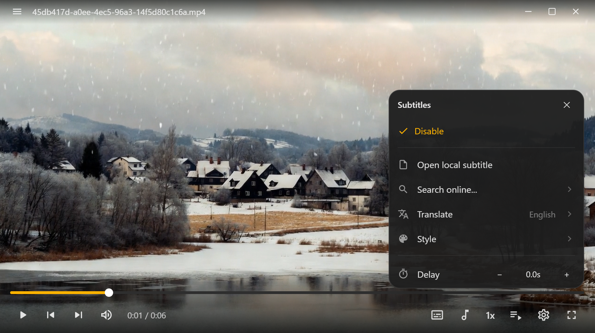
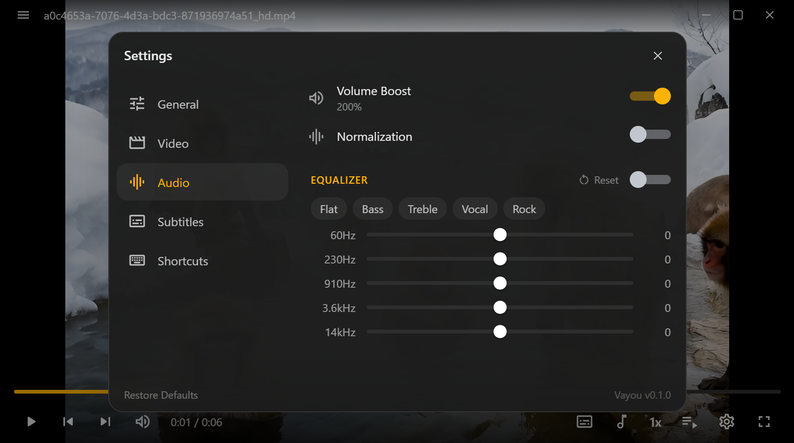

# Vayou (Slint)

A fast, lightweight **native Windows video player** built on **libmpv**, with a
**Rust + [Slint](https://slint.dev)** front-end. A from-scratch port of the
original Tauri/Svelte Vayou to a single-process native UI — **no WebView, no
Tauri**. Optimized for fast startup, low memory, and a small binary.




---

## How it embeds mpv

A single window — no separate video window. mpv renders through its **render
API** (`vo=libmpv`) as an **OpenGL underlay**: each frame, Slint's femtovg
backend clears the framebuffer, then in the `BeforeRendering` notifier mpv draws
the current video (subtitles included) into it, and Slint paints the UI on top
(see [`src/video_render.rs`](src/video_render.rs)). The window background is
transparent so the rounded corners reveal the desktop; everywhere mpv draws is
opaque video. GL state mpv leaves dirty is snapshotted and restored around the
render so it can't corrupt femtovg. [`src/win.rs`](src/win.rs) only handles the
native frame (icon, drag, fullscreen/maximize, always-on-top, rounded corners).

## Features

- **Playback** — play/pause, seek, speed 0.25–4×, frame-step, screenshot, A–B
  loop, chapters, open-from-URL, resume position, sleep timer
- **Audio** — multi-track (per-file persisted), 10-band-mapped equalizer with
  presets, loudness normalization, volume boost to 200%, audio delay
- **Subtitles** — embedded + external (SRT/ASS/SSA), per-file persistence,
  customizable style (font/size/colors/border/position/bold), **OpenSubtitles
  search + download**, **automatic translation into 12 languages** (preserving
  ASS styling), subtitle delay
- **Video** — brightness/contrast/saturation, aspect-ratio cycling, deinterlace,
  zoom & pan (numpad)
- **Window & UX** — frameless transparent window, custom title bar, always-on-
  top, **drag & drop** to play, rebindable shortcuts, 12 UI languages, auto-
  hiding controls in fullscreen

## Screenshots

| Subtitles | Audio |
|---|---|
|  |  |
| Multi-track subtitles, OpenSubtitles search, on-the-fly translation | 5-band equalizer, normalization, volume boost up to 200% |

## Architecture

```
src/
├── mpv/          libmpv FFI (libloading), player wrapper, event loop
├── services/     pure logic: playback, tracks, video, audio_fx, playlist,
│                 settings, translate, subtitle_extract, opensubtitles, media_info
├── state.rs      MpvState + AppState + ab-loop + pending-resume
├── win.rs        the video host window + fullscreen/maximize/always-on-top
├── keybindings.rs rebindable shortcut table + resolver
├── translate_job.rs  subtitle-translation orchestration (tokio fan-out)
└── main.rs       Slint setup, mpv init, event sink → UI, callback wiring
ui/
├── app.slint     the single MainWindow (controls, panels, menus, settings)
├── widgets.slint reusable components (buttons, slider, switch, menu rows, panel)
├── icons.slint   monochrome SVG-path icon set
└── theme.slint   dark M3 palette
lang/<code>/LC_MESSAGES/vayou.po   bundled translations (12 languages)
```

**Event flow**: mpv events arrive on a dedicated thread and are forwarded to the
Slint UI thread via a sink + `invoke_from_event_loop`. Commands flow downward
(UI callback → service → mpv). Off-thread work (HTTP search/translate, ffmpeg
extraction) runs on a shared tokio runtime, results marshalled back to the UI.

## Build from source

Prerequisites: **Rust** (stable), **MSVC Build Tools** (Desktop C++ workload).

`libmpv-2.dll` and `ffmpeg.exe` are not committed (≈220 MB). Drop them into
`binaries/` (libmpv from the mpv-player-windows builds; ffmpeg from gyan.dev).

```sh
cargo build --release          # → target/release/vayou.exe
```

For `cargo run`/dev, the two binaries also need to sit next to the built exe
(`target/debug/`); the loader checks the exe dir + a `binaries/` subfolder.

## Installer & updates

A per-user installer (`Vayou-Setup.exe`, no admin / no UAC) and the `latest.json`
self-update manifest are produced by [`installer/build.ps1`](installer/build.ps1)
(NSIS + rsign2):

```powershell
powershell -ExecutionPolicy Bypass -File installer/build.ps1
```

It builds the release, bundles `vayou.exe` + `libmpv-2.dll` + `ffmpeg.exe`, signs
the binary with a **minisign** key, and emits `latest.json`. The in-app updater
(**Settings → About**) checks the feed, then downloads and swaps **only**
`vayou.exe` after **verifying its minisign signature** against the public key
embedded in the app — a tampered or unsigned download is rejected before it can
replace the running binary. A libmpv bump ships a fresh installer instead.

## Keyboard shortcuts

Rebindable in **Settings → Shortcuts**. Defaults: `Space` play/pause, `←/→`
seek ±5s (`Shift` ±30s), `↑/↓` volume, `M` mute, `F`/`F11` fullscreen, `. ,`
frame-step, `+ -` speed, `L` A–B loop, `V`/`A` cycle sub/audio, `S` screenshot,
`R` aspect, `N/P` next/prev, `I` media info, `Ctrl+O/U` open file/URL. Numpad
`8 2 4 6` pan, `5` reset, `* /` zoom (fixed).

## Third-party

libmpv (LGPL-2.1+), FFmpeg (LGPL/GPL), Slint (GPLv3 / royalty-free / commercial),
OpenSubtitles + Google Translate (unofficial endpoint) — their terms apply.

## License

MIT © Ohgawa.
