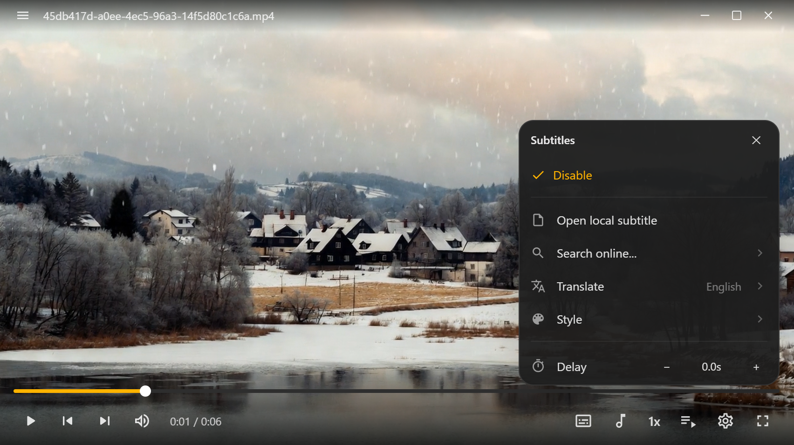
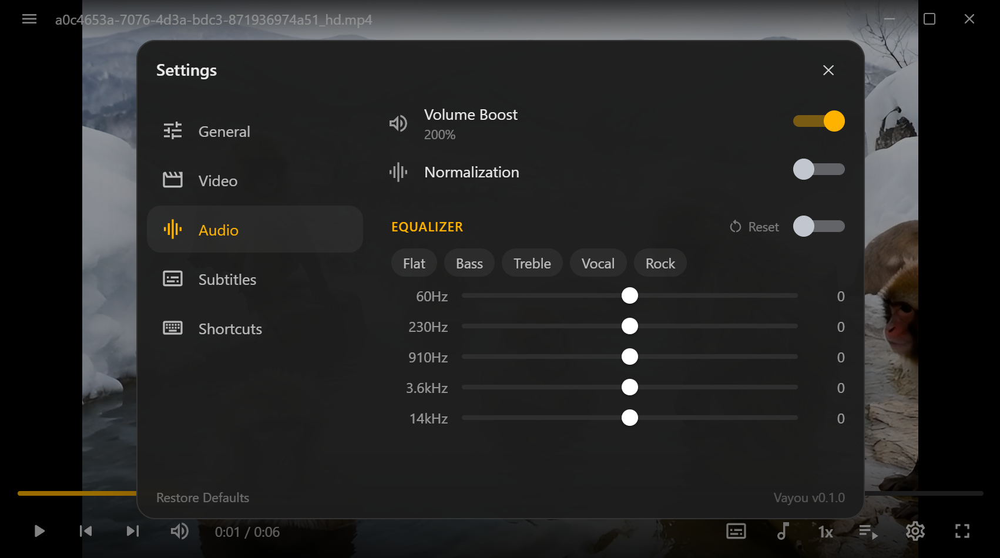

# Vayou (Slint)

A fast, lightweight **native video player** for **Windows and Linux**, built on
**libmpv** with a **Rust + [Slint](https://slint.dev)** front-end. A from-scratch
port of the original Tauri/Svelte Vayou to a single-process native UI — **no
WebView, no Tauri**. Optimized for fast startup, low memory, and a small binary.


---

## How it embeds mpv

A single window — no separate video window. mpv renders through its **render
API** (`vo=libmpv`) as an **OpenGL underlay**: each frame, Slint's femtovg
backend clears the framebuffer, then in the `BeforeRendering` notifier mpv draws
the current video (subtitles included) into it, and Slint paints the UI on top
(see [`src/video_render.rs`](src/video_render.rs)). The window is frameless with
a transparent background; everywhere mpv draws is opaque video. GL state mpv
leaves dirty is snapshotted and restored around the render so it can't corrupt
femtovg.

On Unix the render context is also handed the **X11 or Wayland display**. That is
what lets libmpv open a VA display and decode on the GPU; without it hardware
decoding is disabled *silently*, and the only symptom is a CPU pegged by software
decoding. [`src/win/`](src/win/) holds the native frame — icon, drag,
fullscreen/maximize, always-on-top, cursor — one module per platform behind a
single API.

## Features

- **Playback** — play/pause, seek, speed 0.25–4×, frame-step, screenshot, A–B
  loop, chapters, open-from-URL, resume position, sleep timer
- **Audio** — multi-track (per-file persisted), 10-band-mapped equalizer with
  presets, loudness normalization, volume boost to 200%, audio delay
- **Subtitles** — embedded + external (SRT/ASS/SSA), per-file persistence,
  customizable style (font/size/colors/border/position/bold), **OpenSubtitles
  search + download**, **automatic translation into 12 languages** (preserving
  ASS styling), subtitle delay
- **Video** — brightness/contrast/saturation, aspect-ratio cycling, deinterlace,
  zoom & pan (numpad)
- **Window & UX** — frameless transparent window, custom title bar, always-on-
  top, **drag & drop** to play, rebindable shortcuts, 12 UI languages, auto-
  hiding controls in fullscreen

## Screenshots

| Subtitles | Audio |
|---|---|
|  |  |
| Multi-track subtitles, OpenSubtitles search, on-the-fly translation | 5-band equalizer, normalization, volume boost up to 200% |

## Architecture

```
src/
├── mpv/          libmpv FFI (libloading), player wrapper, event loop
├── services/     pure logic: playback, tracks, video, audio_fx, playlist,
│                 settings, translate, subtitle_extract, opensubtitles, media_info
├── state.rs      MpvState + AppState + ab-loop + pending-resume
├── win/          the window chrome, one module per platform (Win32 / winit)
├── keybindings.rs rebindable shortcut table + resolver
├── translate_job.rs  subtitle-translation orchestration (tokio fan-out)
└── main.rs       Slint setup, mpv init, event sink → UI, callback wiring
ui/
├── app.slint     the single MainWindow (controls, panels, menus, settings)
├── widgets.slint reusable components (buttons, slider, switch, menu rows, panel)
├── icons.slint   the icon set as SVG path data
└── theme.slint   dark M3 palette
lang/<code>/LC_MESSAGES/vayou.po   bundled translations (12 languages)
```

**Event flow**: mpv events arrive on a dedicated thread and are forwarded to the
Slint UI thread via a sink + `invoke_from_event_loop`. Commands flow downward
(UI callback → service → mpv). Off-thread work (HTTP search/translate, ffmpeg
extraction) runs on a shared tokio runtime, results marshalled back to the UI.

## Build from source

### Windows

Prerequisites: **Rust** (stable), **MSVC Build Tools** (Desktop C++ workload).

`libmpv-2.dll` and `ffmpeg.exe` are not committed (≈220 MB). Drop them into
`binaries/` (libmpv from the mpv-player-windows builds; ffmpeg from gyan.dev).

```sh
cargo build --release          # → target/release/vayou.exe
```

For `cargo run`/dev, the two binaries also need to sit next to the built exe
(`target/debug/`); the loader checks the exe dir + a `binaries/` subfolder.
[`dev.bat`](dev.bat) arranges that and tees a verbose log to `dev.log`.

### Linux

libmpv and ffmpeg come from the distribution rather than being bundled, so they
are runtime dependencies instead of files in `binaries/`. The build itself needs
the X11/Wayland and font headers the winit + femtovg backend links against:

```sh
# Debian / Ubuntu — runtime
sudo apt install libmpv2 ffmpeg
# Debian / Ubuntu — build
sudo apt install libx11-dev libx11-xcb-dev libxcb1-dev libxcursor-dev libxi-dev \
                 libxkbcommon-dev libxkbcommon-x11-dev libwayland-dev \
                 libfontconfig1-dev libgl1-mesa-dev

cargo build --release          # → target/release/vayou
```

[`dev.sh`](dev.sh) is the counterpart of `dev.bat`: it builds, runs, and tees a
verbose log, and says which package to install when libmpv is missing — that one
is dlopen'd rather than linked, so its absence is an empty window rather than an
error anybody would recognise.

The file dialog goes through the **XDG desktop portal**, so a desktop without one
installed (`xdg-desktop-portal` plus a backend such as `xdg-desktop-portal-gtk`)
will fail to open files with a DBus error.

**Hardware decoding** is on by default and worth checking once: run with
`VAYOU_LOG=debug` and look for the `decoder in use` line. Anything but `no` means
the GPU is decoding — `nvdec` on NVIDIA, `vaapi` on Intel/AMD.

**Always-on-top is X11-only.** Wayland gives a client no way to raise itself —
stacking belongs to the compositor — so the app reports that instead of leaving
the toggle lit over a window that never moved.

## Installers & updates

Pushing a `v*` tag builds both platforms, signs both binaries and publishes a
draft release carrying a `latest.json` with an entry for each. Signing happens in
a `release` environment that requires an approval first, and the workflow
verifies its own signatures against the public key it reads out of
[`src/update.rs`](src/update.rs) — a key that no longer matches fails the build
rather than shipping a feed every installed copy would reject.

The release carries, per platform:

- **Windows** — `vayou.exe` (what the updater swaps) and `Vayou-Setup.exe`, an
  NSIS per-user installer needing no admin or UAC, bundling `vayou.exe` +
  `libmpv-2.dll` + `ffmpeg.exe`.
- **Linux** — `vayou` and `vayou-<version>-linux-x86_64.tar.gz` (binary +
  `install.sh` + desktop entry + icon). Nothing is bundled: libmpv and ffmpeg are
  distribution packages resolved at runtime, which is why a libmpv bump needs a
  fresh installer on Windows but no new release on Linux.

[`build.ps1`](installer/build.ps1) and
[`build-linux.sh`](installer/build-linux.sh) still do the same work locally, for
a build you want to hold in your hand before tagging. They need `rsign2`
(`cargo install rsign2`); CI does not, and uses `minisign` directly.

**One feed, both platforms.** `latest.json` carries an entry per platform and a
build reads only its own, so a *missing* entry says "nothing for me" rather than
"broken feed" — which is why a half-written manifest fails silently. Building
both halves in one run is what keeps that from happening: the scripts each write
only their own half and were run on separate machines, so the file had to be
carried between them, and a release that skipped a machine published a feed with
one platform missing.

The in-app updater (**Settings → About**) checks the feed, then downloads and
swaps **only** the app binary after **verifying its minisign signature** against
the embedded public key — a tampered or unsigned download is rejected before it
can replace the running binary. It only offers to do so when the install is one
it can actually rewrite: a Flatpak or a system-wide install is named as such and
pointed at the release page, rather than being handed a download that would fail
on the last step.

### Installing on Linux

On Arch and its derivatives, through the package manager — the one route where
libmpv and ffmpeg arrive on their own, because a package can say it needs them
and a tarball cannot:

```sh
curl -O https://raw.githubusercontent.com/0hgawa/vayou-slint/master/installer/PKGBUILD
makepkg -si
```

Anywhere else, from the tarball, or straight from a source tree after
`cargo build --release`:

```sh
./install.sh                 # from the unpacked tarball
installer/install-linux.sh   # from a source tree
```

Those two land everything under the XDG base directories — `~/.local/bin/vayou`,
a desktop entry and an icon — so no root is involved and `--uninstall` removes
exactly what was added. Neither installs libmpv or ffmpeg: they check, and name
the package to install if either is missing. Without libmpv the window opens and
says so rather than taking a file and playing nothing.

The desktop entry is what makes Vayou appear in **Open With** and as a default
handler. File-type icons stay the icon theme's: on freedesktop a file's icon
comes from its MIME type, not from the application that opens it, so the
per-format icons the Windows build registers have no equivalent here.

## Keyboard shortcuts

Rebindable in **Settings → Shortcuts**. Defaults: `Space` play/pause, `←/→`
seek ±5s (`Shift` ±30s), `↑/↓` volume, `M` mute, `F`/`F11` fullscreen, `. ,`
frame-step, `+ -` speed, `L` A–B loop, `V`/`A` cycle sub/audio, `S` screenshot,
`R` aspect, `N/P` next/prev, `I` media info, `Ctrl+O/U` open file/URL. Numpad
`8 2 4 6` pan, `5` reset, `* /` zoom (fixed).

## Third-party components

Redistributed binaries, toolkits, icons and services whose own terms apply,
independently of this project's MIT license:

| Component | Terms |
|---|---|
| **Slint** (UI toolkit) | Subject to Slint's own licensing — GPLv3, royalty-free desktop, or commercial. A distributed build has to be covered by one of them; see [slint.dev](https://slint.dev). |
| **libmpv** | LGPL-2.1-or-later. Source at [github.com/mpv-player/mpv](https://github.com/mpv-player/mpv). |
| **FFmpeg** | LGPL-2.1-or-later or GPL-2.0-or-later, depending on the build. |
| **Material Symbols** / **Material Icons** (the icon set, as path data in `ui/icons.slint`) | Apache-2.0. Source at [google/material-design-icons](https://github.com/google/material-design-icons). |
| **OpenSubtitles** | Subject to the [OpenSubtitles terms of service](https://www.opensubtitles.org/en/terms). |
| **Google Translate** (unofficial endpoint) | The endpoint used is undocumented and may rate-limit or block without notice. Translation is best-effort. |

## License

[MIT](LICENSE) © Ohgawa — the same license as the Tauri build, since the two
are one product in two implementations.
